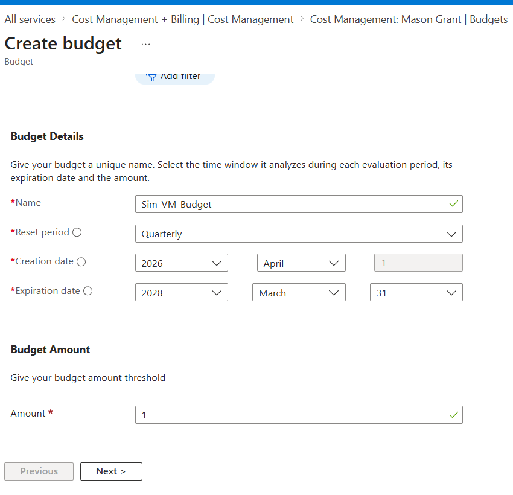

When setting up any VM, cost management is an integral factor to ensure that you meet set budgets and ensure a harmonious link between effciency and cost.
Here we can see an example of the cost management tools provided in Azure

Within Azure, we can set an exact monetary value to prevent overspending. Additionally, we can set expiration dates for budgets, meaning we can alleviate budgets once a certain date has passed. This completely automates this aspect of the budgetary process, allowing for increased efficiency and better allocation of manpower.
