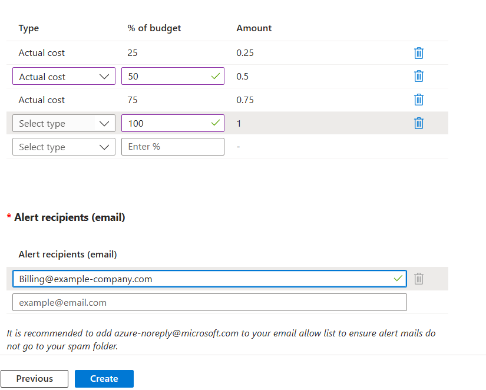

When setting up any VM, cost management is an integral factor to ensure that you meet set budgets and ensure a harmonious link between effciency and cost.
Here we can see an example of the cost management tools provided in Azure

Within Azure, we can set an exact monetary value to prevent overspending. Additionally, we can set expiration dates for budgets, meaning we can alleviate budgets once a certain date has passed. This completely automates this aspect of the budgetary process, allowing for increased efficiency and better allocation of manpower.

However, in real scenarios budgeting is not so black and white. Therefore, we need additional tools to ensure budgets are adhered to. for instance we might have a set budget for one contractor within in a quarter but maybe we want to examine their resource usage during their contract and act accordingly to prevent any stoppages in work flow due to a mismanaged budget. In this example we can see the budget alert tools availble within microsoft azure.

