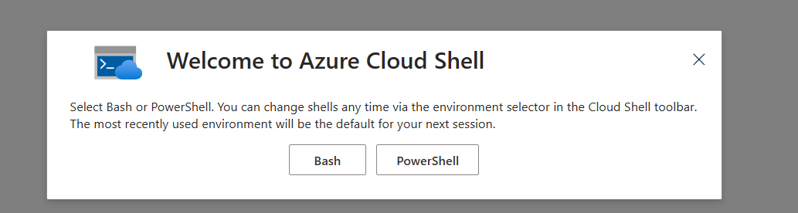
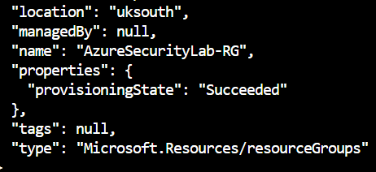
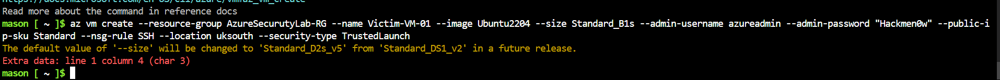
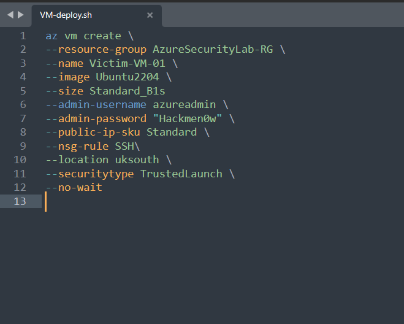
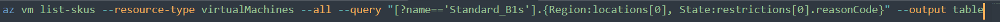
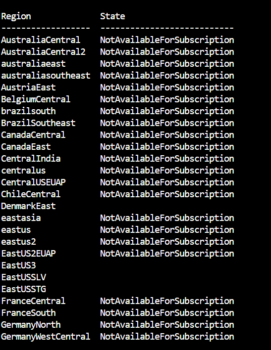

Within the Azure website there is a CLi located at the very top seen here in this photo, click it to open the CLI.

This is an important resource that allows us to quickly provision and configure resources with just a few lines of code! 
once you press the CLI button you prompted to choose between powershell and bash as seen here in this instance I am going to be coding in Bash

Note: I am going to be including my process as Azure is a framwork that is rather fast changing. I will be demonstrating my issues and sharing guidance on how to get past a bug that occurs when provising VMs this bug is 2 days old at the time of writing.

once you have booted up an CLI we can start by setting up a resource group(RG)! resource groups are necessary to to provision a VM via the CLI additionally resource groups are very handy for managing multiple different projects as we can assign budgets for individual resource groups
Here is the following code,typed up in sublime, needed to provision our resource group this can copied directly into the CLI

the location for this RG would logically be a database like 'uksouth' as that is geographically close to me but as I am on the free tier of Azure at the moment I am limited to what databases I can utilise for these labs
once the code runs successfully we should see a message saying success like this 

However if this isn't the case you can check what resource groups you have active via the following command "az group list"
this will display all active RGs that you have. an important note to make when chacking active resource groups is that microsoft automatically provision an RG called "networkwatcherRG" this is used by microsoft to monitor the status of any VMs you provision and allow to troubleshoot any networking issues with your VMs

Once we have established our resource group we are now able to provision resources requiring an RG quickly from within the CLI
This code will quickly provision an Ubuntu 2204 server with whatever user and pass we desire. we can also define NSG rules and the database from which the VM will be hosted. It is also very important to note that the line at the bottom '--no-wait' is crucial to getting the VM to actually deploy due to a bug. (here is an example of what the bug looks like)

this code does not work I had to troubleshoot and research in order to actually get this VM to work but I managed it in the end, here is the working code and I will explain why the previous code did not create a VM.

The first issue with the previous code was that I am on the free tier of Azure, as a result, I am unable to use certain databases. Moreover, It can be quite to hard to find free databases in the working week as there has to be free space for a VM to succesfully be provisioned, this adds an additional challenge as we also have to find a database we have access to but also has space for us. Thankfully, there is a method I managed to use in order to determine where the free spaces are.

The method I used was utilizing the Azure portal GUI store. we can select 'Virtual machines' and all we have to do is try to select a server and the GUI will tell us if that server is at capacity.

This method works but could be faster. by leveraging AI i have also found the following code 
This will then produce a table  

the blank spaces indicate what servers are available. the names of available regions can be switched into your code as necessary as the 'location' value, exactly as they appear.
